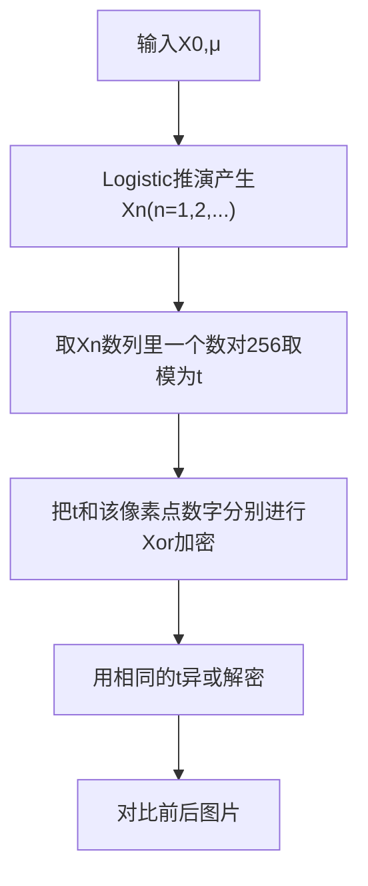

## 项目概述

- 起因
- 什么是Logistic混沌映射
- Python图片处理的相关内容
- 实现过程
- 遇到的问题
- 总结

## 起因

强基数学课程听得云里雾里，“误入歧途”和“走了歪路”双管齐下，老师的 **“故国神游式”** 讲法让我对上课内容一脸懵逼。一天晚上，我心血来潮，想找找上课所讲的逻辑斯蒂映射的动态图，结果没有找到，但是找到了这个：


于是乎，我心血来潮地打开Python尝试实现这东西。

:spoiler[ ~~搞这个比上强基好多了~~ ]

## Logistic混沌映射


> 重要特点：
>   - **随机性**
>   - **对初值的敏感性**

## Python图片处理

> 涉及的Python库： **PIL** （图片处理）

函数|功能
---|---
Image.open()|打开一个图片
Image.size()|获取图片大小
Image.mode()|获取图片色彩模式(RGB/RGBA/灰度/etc.)
Image.getpixel((x,y))|获取某个像素点的颜色信息
Image.putpixel((x,y),color)|把某个点改为某颜色
Image.save()|保存图片

## 实现过程

### 前置知识

以RGB模式为例，像素点颜色的存储常为(R,G,B)，代码中体现为为color[ $0$ ~ $2$ ]，范围均为 $0$ - $255$ 。

为了满足 **可还原性** （这里指A op B op B=A）和 **封闭性** （这里指能将产生的数固定在某个范围）的要求，我们引入 **“亦或”** 操作。

**异或** (Xor/⊕)：把两个数字化成二进制，对于每一位的两个数码，相同得0，不同得1，最后得到的数化回十进制数。整个过程 **相当于不进位的加法** 。例子如下：

```txt
1001(9)
1010(10)   ⊕
---------------
0011(3)


0011(3)
1010(10)   ⊕
----------------
1001(9)
```

至此我们完成了具体实现方式的构建。

### 实现流程

加密和解密的桥梁，就是用同一组X0和μ进行Logistic推演产生的Xn数列。



### 代码实现

```python
from PIL import Image
import math
import msvcrt

def Logistic(r,x,n):
    for i in range(n):
        x=r*x*(1-x)
    return x

if __name__=="__main__":
    #open
    image=Image.open(input('input file name:'))
    name=input('output file name:')
    width,height=image.size
    mode=image.mode
    print(f'Width:{width},Height:{height},Mode:{mode}')
    if mode!='RGB' and mode!='RGBA':
        print("can't do it")
    else:
        print('example r=3.75 x=0.50')
        r=float(input('r(3.57<=r<=4.00):'))
        x=float(input('x(0<x<1):'))
        #r,x=3.75,0.50
        temp=int(1145*r*r*r)
        x=Logistic(r,x,temp)
        key=0
        for xx in range(width):
            for yy in range(height):
                pixel=image.getpixel((xx,yy))
                x=Logistic(r,x,int(r*r))
                key=int(math.sqrt(x)*temp)%256
                aa=pixel[0]^key
                x=Logistic(r,x,int(math.sqrt(r)))
                key=int(math.sqrt(x)*temp)%256
                bb=pixel[1]^key
                x=Logistic(r,x,int(r))
                key=int(math.sqrt(x)*temp)%256
                cc=pixel[2]^key
                pixel=(aa,bb,cc)
                image.putpixel((xx,yy),pixel)
        image.save(name)
        print('finished.')
    print("Press any key to exit...")
    msvcrt.getch()
```

## 遇到的问题

- 图片格式会影响加密解密效果

png格式兼容性好，效果好；而jpg格式由于压缩的不可知问题会导致如下情景：

[grid]


[/grid]

- 图片的存储大小变化

经过解密再加密的图片和原图相比，存储小了很多。


暂时原因未知，猜测可能是：
1. 非图片内容的其他信息数据被修改或破坏
2. 图片在还原过程中有肉眼不可见的瑕疵，未能完美还原

暂时没有发现对图片质量产生明显影响的情况。 :spoiler[ ~~至少还能打的开~~ ]

## 总结

- Logistic映射的 **随机性** 很好的实现了图片像素点随机加密
- **初值敏感性** 使得对图片的X0,μ的 **暴力破解十分困难** 
- 从同一初始X0,μ开始时产生序列的 **不变性** ，使得图片的加密和解密 **过程可逆** 
- 诸如 **存储大小变化** 等未知问题仍待解决，目前暂时不敢将其应用于机密信息的加密
